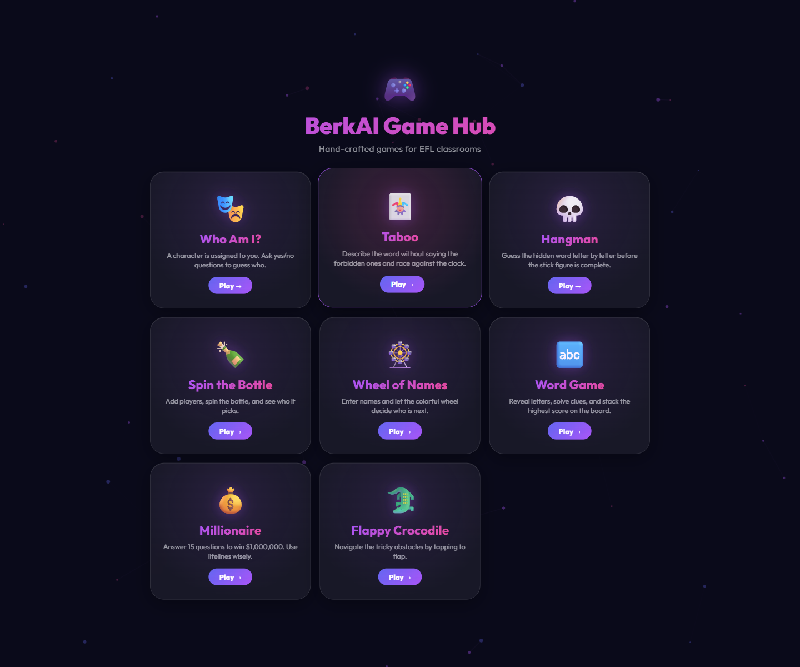
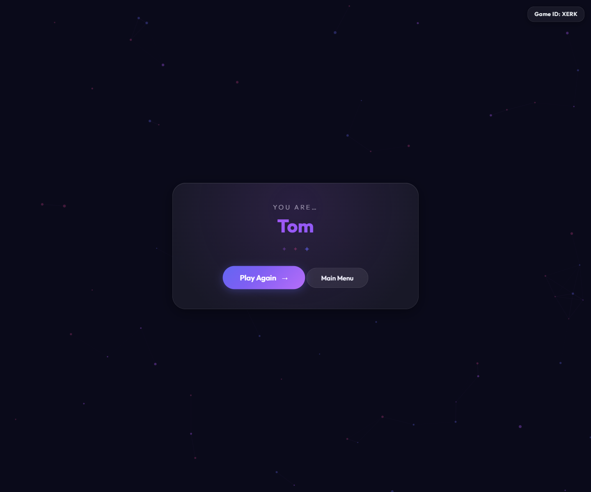
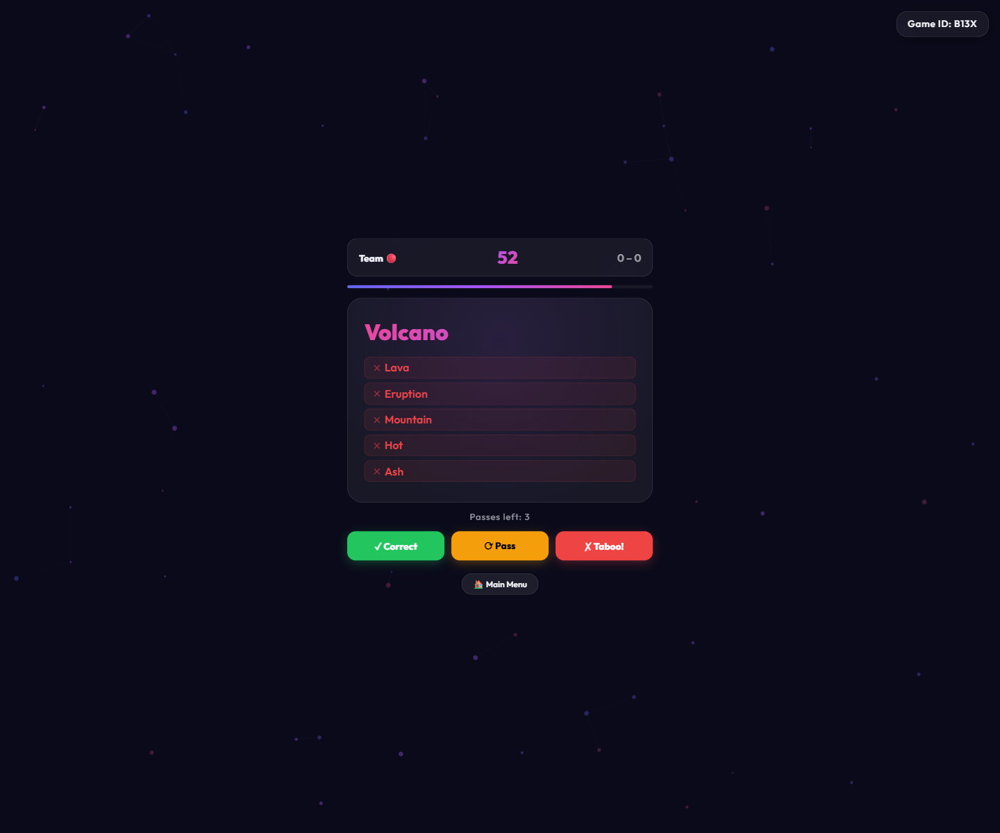
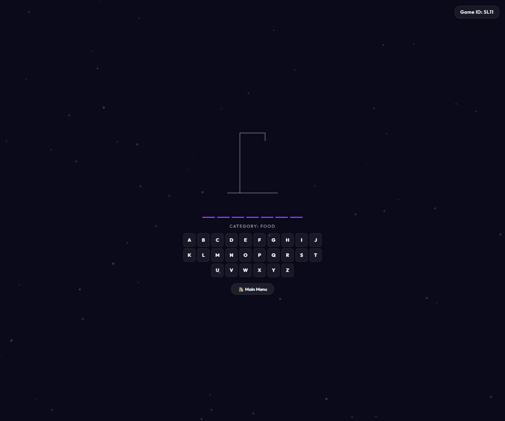
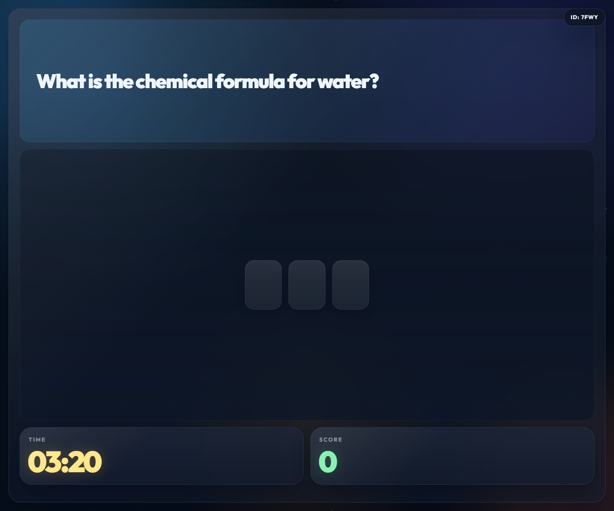
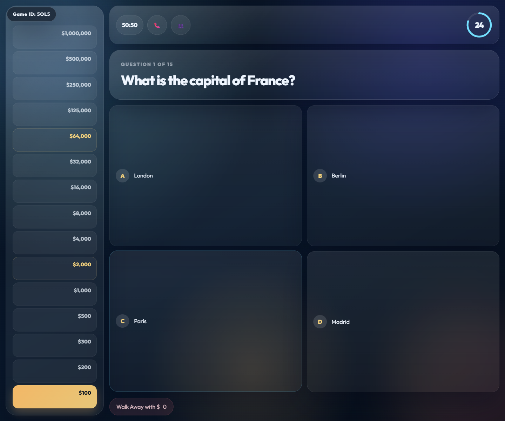
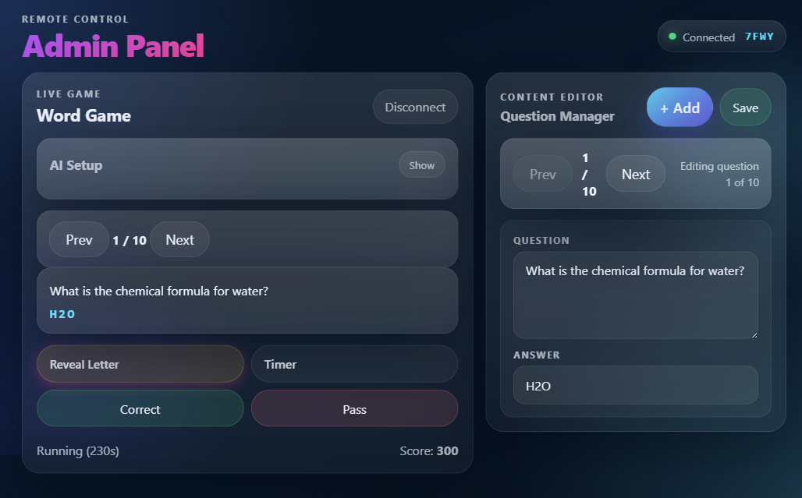

# BerkAI Game Hub

Interactive browser party games for classrooms, clubs, and group play. The project runs on plain HTML/CSS/JS with an Express + Socket.IO backend and uses Gemini for theme-based AI content generation.

The old screenshot-to-book generation flow has been removed from the app and server. AI generation still works through text themes for the supported games.

## Included Games

- **Who Am I?**: countdown-based character reveal game with AI-generated character packs
- **Taboo**: team word-description game with timers, scoring, and AI-generated card sets
- **Hangman**: classic word guessing with categories and AI-generated word packs
- **Spin the Bottle**: local multiplayer bottle spinner
- **Wheel of Names**: customizable name wheel for random picks
- **Word Game**: admin-controlled classroom word game with AI-generated question packs
- **Who Wants to Be a Millionaire?**: 15-question quiz ladder with lifelines and admin sync
- **Flappy Crocodile**: self-contained arcade mini-game

## Screenshots

### Hub


### Who Am I?


### Taboo


### Hangman


### Word Game


### Millionaire


### Admin Panel


## Features

- Flat-file setup with no database
- Real-time host/admin sync through Socket.IO
- Theme-based AI generation for `Who Am I?`, `Taboo`, `Hangman`, `Word Game`, and `Millionaire`
- Local reuse of the last generated pack per supported game
- Mobile-friendly glassmorphism UI

## Local Setup

### Prerequisites

- Node.js 16+
- A Gemini API key if you want AI generation

### Install

```bash
npm install
```

### Environment

Create `.env` in the project root:

```env
GEMINI_API_KEY=your_actual_api_key_here
PORT=8090
ALLOWED_ORIGINS=http://localhost:8090,http://play.berkaybilge.space
```

### Run

```bash
npm start
```

Open `http://localhost:8090`.

## Admin Panel

Open `http://localhost:8090/admin.html`, enter the 4-character game ID shown on a host screen, and control supported games remotely.

Current admin-supported game flows:

- `Who Am I?`: character sync
- `Hangman`: word list sync
- `Taboo`: card sync
- `Word Game`: full remote round control and question editing
- `Millionaire`: question sync, editor, and lifeline controls

## AI Endpoints

- `POST /api/generate`
- `POST /api/generate-taboo`
- `POST /api/generate-hangman`
- `POST /api/generate-kelime`
- `POST /api/generate-millionaire`
- `GET /api/health`

## Manual Smoke Test

The following flows were smoke-tested locally against the current repo state:

- Hub page load and navigation
- `Who Am I?`: start countdown and reveal
- `Taboo`: setup, start turn, and first card render
- `Hangman`: start game and keyboard render
- `Spin the Bottle`: add 3 players, start, and spin
- `Wheel of Names`: load and spin
- `Word Game`: host load, admin connect, and round start from admin
- `Millionaire`: default-question start and question render
- `Flappy Crocodile`: load and start

Benign note: pages without an explicit favicon may log a `favicon.ico` 404 in the browser console during local testing.
