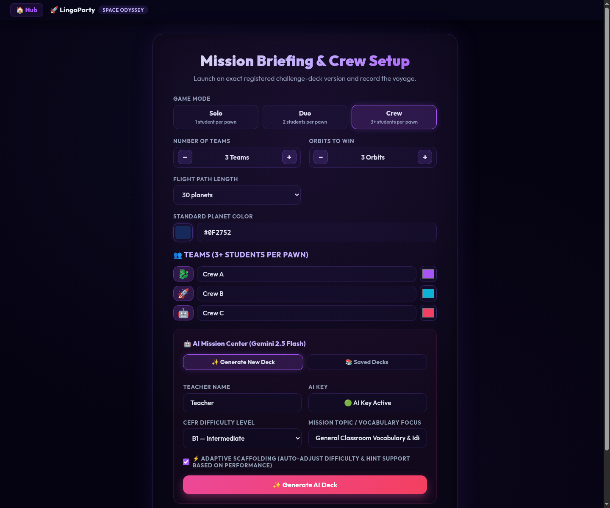
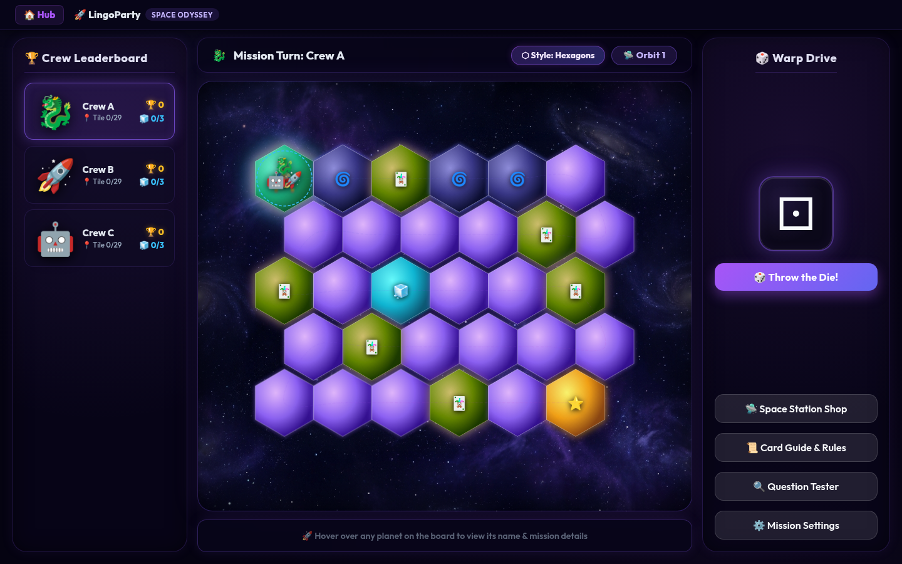

# OpenClassTools

OpenClassTools is a browser-based collection of classroom games for teachers. It works well on a projector or smartboard, and students can play together without creating accounts, joining rooms, or using their own devices.

**Live site:** [play.metrix.dpdns.org](https://play.metrix.dpdns.org)

## LingoParty

LingoParty is the main game in the collection. The teacher sets up the teams, chooses the number of orbits and launches a deck. Teams move across the board, answer language challenges and collect trophies.



The board is designed for whole-class use. It includes team tracking, challenge cards, chance tiles, a space-station shop and a final goal tile.



## Other classroom games

The hub also includes:

- **Who Am I?** for character guessing with yes/no questions
- **Taboo** for vocabulary description without using forbidden words
- **Hangman** for spelling and word recall
- **Millionaire** for a 15-question quiz-show round
- **Word Game** for clue-based vocabulary practice
- **Vocabulary Flashcards** for review and recall
- **Six Thinking Hats** for structured classroom discussion
- **Wheel of Names** and **Spin the Bottle** for quick student selection

## Decks and AI generation

Most games use reusable named decks. A teacher can launch an existing deck or generate a new one around a topic and CEFR level.

Generated decks are stored as versioned records, so a saved game does not quietly change later. Teacher-provided Gemini keys stay in the current browser tab's `sessionStorage`; OpenClassTools does not save them.

AI generation is optional. The included system decks and ordinary gameplay still work without it.

## Running it locally

You need Node.js 18 or newer. Persistent decks and play-session records use Supabase.

```bash
git clone https://github.com/aerladis/openclasstools.git
cd openclasstools
npm install
```

Copy `.env.example` to `.env` and add your configuration:

```env
GEMINI_API_KEY=your_gemini_api_key_here
PORT=8090
SUPABASE_URL=https://your-project.supabase.co
SUPABASE_SERVICE_ROLE_KEY=your_server_only_service_role_key
```

Apply the database migration described in [docs/database.md](docs/database.md), then seed the built-in decks and start the server:

```bash
npm run seed:decks
npm start
```

Open [http://localhost:8090](http://localhost:8090).

## How the project is organised

React and Vite power the main hub and LingoParty. The other games are focused browser clients served by the same Express server.

Game state stays in the browser. The server handles named decks, AI generation and optional session records through HTTP APIs. There are no room codes or real-time remote-control connections.

Useful endpoints:

- `GET /api/decks?gameType=...` lists current decks for a game.
- `POST /api/generate*` generates and registers a named deck.
- `POST /api/sessions` starts an optional play record.
- `PATCH /api/sessions/:id/complete` completes a play record.
- `GET /api/health` reports server health.

## Tests and build checks

```bash
npm test
npm --prefix frontend run lint
npm --prefix frontend run build
```
