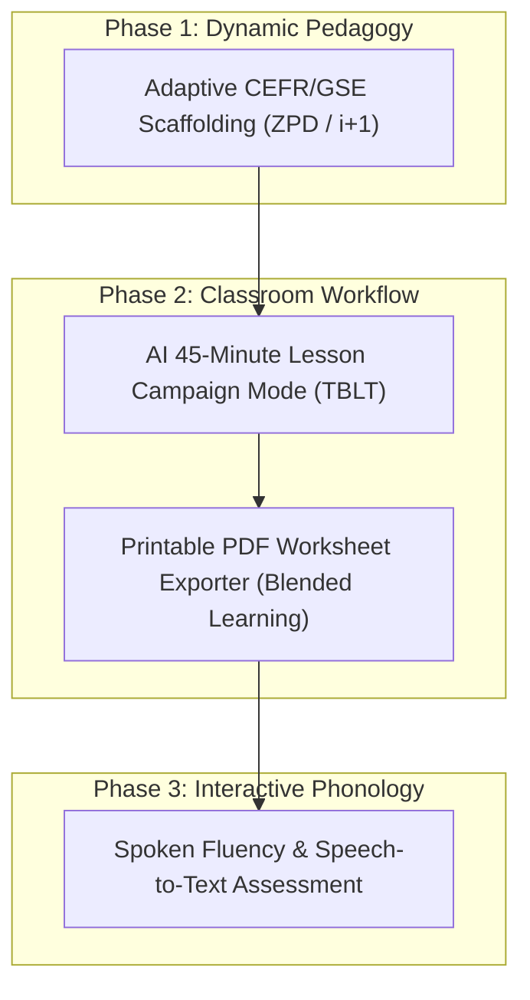

# OpenClassTools: Comprehensive ELT Feature Research & Strategic Roadmap

**Date**: 2026-08-06  
**Author**: AI Pair Programmer  
**Target Domain**: English Language Teaching (ELT), EFL, Gamified Pedagogy  

---

## 🌟 Executive Overview

This document presents an extensive research and architectural roadmap for OpenClassTools. Based on leading digital pedagogy research from **Cambridge University Press & Assessment**, **Pearson Global Scale of English (GSE)**, and **Task-Based Language Teaching (TBLT)** frameworks, these four core feature suites elevate OpenClassTools into an all-in-one ecosystem for communicative language teaching.

---

## 🗺️ Strategic Feature Roadmap

---

## 📑 Feature Specifications Directory

| Feature Suite | Theoretical ELT Foundation | Key Innovation | Specification Document |
| :--- | :--- | :--- | :--- |
| **1. Dynamic CEFR/GSE Adaptive Scaffolding** | Vygotsky's ZPD; Krashen's $i+1$ Input Hypothesis; Pearson GSE | In-game difficulty scaling based on team accuracy (word banks vs. unassisted production). | [2026-08-06-adaptive-cefr-gse-scaffolding-design.md](file:///home/berkay/Desktop/who/docs/superpowers/specs/2026-08-06-adaptive-cefr-gse-scaffolding-design.md) |
| **2. AI 45-Minute Lesson Campaign Mode** | Willis's Task-Based Language Teaching (TBLT); Pre/Task/Post Cycle | Single-prompt generation of a 4-game cohesive lesson quest (Warm-up $\rightarrow$ Vocab $\rightarrow$ Main Game $\rightarrow$ Quiz Review). | [2026-08-06-ai-lesson-campaign-mode-design.md](file:///home/berkay/Desktop/who/docs/superpowers/specs/2026-08-06-ai-lesson-campaign-mode-design.md) |
| **3. Printable PDF Classroom Worksheet Exporter** | Tomlinson's Material Development; Blended Offline Extensions | One-click CSS `@media print` export to Pair-Work A/B Info-Gap sheets and Cut-out Flashcard grids. | [2026-08-06-printable-classroom-worksheet-exporter-design.md](file:///home/berkay/Desktop/who/docs/superpowers/specs/2026-08-06-printable-classroom-worksheet-exporter-design.md) |
| **4. Spoken Fluency & Speech-to-Text Assessment** | Ellis & Nation's Oral Fluency; Willingness to Communicate (WTC) | Web Speech API integration for instant oral pronunciation accuracy & focus stress feedback. | [2026-08-06-spoken-fluency-speech-recognition-design.md](file:///home/berkay/Desktop/who/docs/superpowers/specs/2026-08-06-spoken-fluency-speech-recognition-design.md) |

---

## 💡 Recommendation & Next Steps

When ready to implement any of these feature suites:
1. Recommend using the `/goal` command for overnight/autonomous execution.
2. Select the prioritized feature suite (e.g. **Adaptive Scaffolding** or **Lesson Campaign Mode**).
3. The corresponding specification doc in `docs/superpowers/specs/` contains complete data schemas, API contracts, and testing strategies ready for execution.
