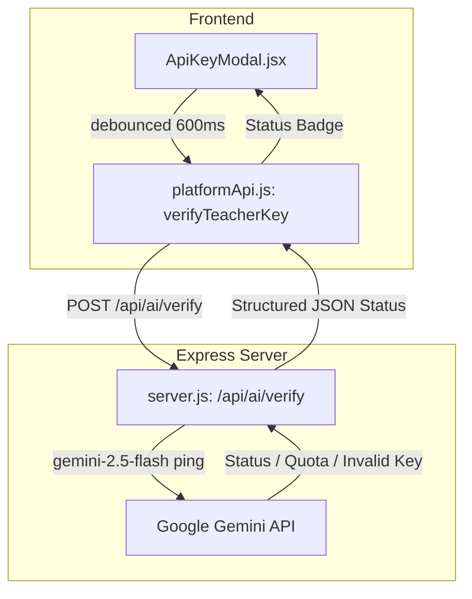

# Teacher API Server Check & Gemini Key Verification Implementation Plan

> **For agentic workers:** REQUIRED SUB-SKILL: Use superpowers:subagent-driven-development to implement this plan task-by-task. Steps use checkbox (`- [ ]`) syntax for tracking.

**Goal:** Implement an auto-triggering API server check and Gemini key verification endpoint so teachers receive instant diagnostic feedback when entering their API key.

**Architecture:**
A backend route `POST /api/ai/verify` validates the teacher's key against Google Gemini API and returns detailed error codes (`GEMINI_QUOTA_EXCEEDED`, `INVALID_GEMINI_KEY`, `GEMINI_UNAVAILABLE`). The frontend client `platformApi.js` provides `verifyTeacherKey()`, and `ApiKeyModal.jsx` auto-triggers verification on input change with a live status badge.

**Architecture Diagram:**


**Tech Stack:** Node.js, Express, React, Vite, Google Gemini API, Node native test runner (`node --test`).

## Global Constraints
- Node 18+ ES Modules syntax (`import`/`export`, `async`/`await`).
- Keep standalone HTML play working when optional services fail.
- All unit tests must pass using `npm test`.
- React frontend build must succeed using `npm --prefix frontend run build`.

---

### Task 1: Backend Verification Endpoint (`POST /api/ai/verify`)

**Files:**
- Modify: [server.js](file:///home/berkay/Desktop/who/server.js)
- Test: [tests/server.test.js](file:///home/berkay/Desktop/who/tests/server.test.js)

**Interfaces:**
- Consumes: Headers `x-teacher-name`, `x-gemini-api-key`.
- Produces: JSON response with `success`, `code`, `status`, `message` or `error`.

- [ ] **Step 1: Write the failing test for `/api/ai/verify`**

```javascript
// Add to tests/server.test.js
test('POST /api/ai/verify rejects missing headers and returns 400', async () => {
    const res = await fetch('http://localhost:8090/api/ai/verify', {
        method: 'POST',
        headers: { 'Content-Type': 'application/json' }
    });
    assert.strictEqual(res.status, 400);
    const body = await res.json();
    assert.strictEqual(body.success, false);
    assert.strictEqual(body.code, 'TEACHER_NAME_REQUIRED');
});
```

- [ ] **Step 2: Run test to verify it fails**

Run: `node --test tests/server.test.js`
Expected: FAIL (endpoint returns 404 or fails)

- [ ] **Step 3: Implement `POST /api/ai/verify` in `server.js`**

Add route handler before static file middleware:
```javascript
app.post('/api/ai/verify', apiRateLimit, async (req, res) => {
    const teacherName = String(req.headers['x-teacher-name'] || '').trim();
    const apiKey = String(req.headers['x-gemini-api-key'] || '').trim();

    if (!teacherName) {
        return res.status(400).json({
            success: false,
            code: 'TEACHER_NAME_REQUIRED',
            error: 'Teacher name is required'
        });
    }
    if (!apiKey) {
        return res.status(400).json({
            success: false,
            code: 'TEACHER_AI_KEY_REQUIRED',
            error: 'Gemini API key is required'
        });
    }

    try {
        await callGemini('Ping', { apiKey, maxOutputTokens: 1, temperature: 0.1 });
        return res.json({
            success: true,
            status: 'ok',
            message: 'Game server connected & Gemini API key verified'
        });
    } catch (err) {
        if (err.quotaExceeded) {
            return res.status(429).json({
                success: false,
                code: 'GEMINI_QUOTA_EXCEEDED',
                error: 'Gemini API quota or rate limit exceeded (HTTP 429). Please check your Gemini account usage.'
            });
        }
        if (err.retryable === false || String(err.message).includes('400') || String(err.message).includes('403')) {
            return res.status(400).json({
                success: false,
                code: 'INVALID_GEMINI_KEY',
                error: 'Invalid Gemini API key. Please check your key in Google AI Studio.'
            });
        }
        return res.status(502).json({
            success: false,
            code: 'GEMINI_UNAVAILABLE',
            error: 'Gemini API service is currently unavailable. Please try again later.'
        });
    }
});
```

- [ ] **Step 4: Run test to verify it passes**

Run: `node --test tests/server.test.js`
Expected: PASS

- [ ] **Step 5: Commit Task 1**

```bash
git add server.js tests/server.test.js
git commit -m "feat: add /api/ai/verify endpoint for server connectivity and Gemini key validation"
```

---

### Task 2: Frontend Verification Client Function

**Files:**
- Modify: [frontend/src/services/platformApi.js](file:///home/berkay/Desktop/who/frontend/src/services/platformApi.js)
- Modify: [platform-client.js](file:///home/berkay/Desktop/who/platform-client.js)
- Test: [tests/platform-client.test.js](file:///home/berkay/Desktop/who/tests/platform-client.test.js)

**Interfaces:**
- Consumes: `{ teacherDisplayName, geminiApiKey }`.
- Produces: `verifyTeacherKey({ teacherDisplayName, geminiApiKey })` returning `{ success, message }` or throwing `PlatformApiError`.

- [ ] **Step 1: Write failing tests for `verifyTeacherKey`**

```javascript
test('verifyTeacherKey returns success when backend responds OK', async () => {
    // mock fetch returning 200 { success: true, message: 'OK' }
});
```

- [ ] **Step 2: Run test to verify failure**

Run: `node --test tests/platform-client.test.js`
Expected: FAIL (`verifyTeacherKey` is not exported)

- [ ] **Step 3: Implement `verifyTeacherKey` in `platformApi.js` and `platform-client.js`**

```javascript
export async function verifyTeacherKey({ teacherDisplayName, geminiApiKey }) {
    const name = String(teacherDisplayName || '').trim();
    const key = String(geminiApiKey || '').trim();
    if (!name) throw new PlatformApiError('Teacher name is required', { status: 400 });
    if (!key) throw new PlatformApiError('Gemini API key is required', { status: 400 });

    const body = await request('/api/ai/verify', {
        method: 'POST',
        headers: {
            'Content-Type': 'application/json',
            'x-teacher-name': name,
            'x-gemini-api-key': key,
        },
    });

    return body;
}
```

- [ ] **Step 4: Verify test passes**

Run: `node --test tests/platform-client.test.js`
Expected: PASS

- [ ] **Step 5: Commit Task 2**

```bash
git add frontend/src/services/platformApi.js platform-client.js tests/platform-client.test.js
git commit -m "feat: add verifyTeacherKey method to platform clients"
```

---

### Task 3: Teacher Settings UI Auto-Trigger & Diagnostic Feedback

**Files:**
- Modify: [frontend/src/components/Common/ApiKeyModal.jsx](file:///home/berkay/Desktop/who/frontend/src/components/Common/ApiKeyModal.jsx)
- Modify: [frontend/src/components/Common/ApiKeyModal.module.css](file:///home/berkay/Desktop/who/frontend/src/components/Common/ApiKeyModal.module.css)

- [ ] **Step 1: Add debounced auto-verification logic and status state in `ApiKeyModal.jsx`**

```jsx
const [verifying, setVerifying] = useState(false);
const [verifySuccess, setVerifySuccess] = useState('');
const [verifyError, setVerifyError] = useState('');

// Debounced verification effect on apiKey change (if length >= 10 and teacherName non-empty)
useEffect(() => {
    if (!apiKey || apiKey.length < 10 || !teacherName.trim()) return;
    const timer = setTimeout(async () => {
        setVerifying(true);
        setVerifyError('');
        setVerifySuccess('');
        try {
            const res = await verifyTeacherKey({ teacherDisplayName: teacherName, geminiApiKey: apiKey });
            setVerifySuccess(res.message || 'Game server connected & Gemini key verified!');
        } catch (err) {
            setVerifyError(err.message);
        } finally {
            setVerifying(false);
        }
    }, 600);
    return () => clearTimeout(timer);
}, [apiKey, teacherName]);
```

- [ ] **Step 2: Update UI rendering with status badges (testing, success, error)**
- [ ] **Step 3: Update `handleSave` to run verification if not already verified before saving**

- [ ] **Step 4: Verify build and component behavior**

Run: `npm --prefix frontend run build && npm --prefix frontend run lint`
Expected: PASS with 0 errors.

- [ ] **Step 5: Commit Task 3**

```bash
git add frontend/src/components/Common/ApiKeyModal.jsx frontend/src/components/Common/ApiKeyModal.module.css
git commit -m "feat: add auto-trigger verification and diagnostic badges to ApiKeyModal"
```

---

### Task 4: Full System Verification

- [ ] **Step 1: Run full test suite**

Run: `npm test`
Expected: All 70+ tests pass.

- [ ] **Step 2: Run frontend build**

Run: `npm --prefix frontend run build`
Expected: Vite build succeeds with 0 errors.
