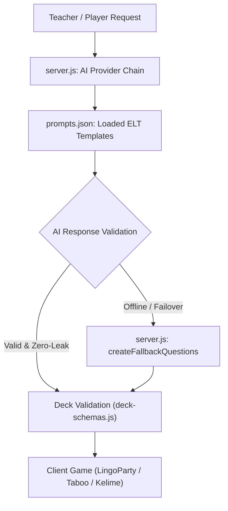

# Modern ELT Game Prompt Enhancements Implementation Plan

> **For agentic workers:** REQUIRED SUB-SKILL: Use superpowers:subagent-driven-development to implement this plan task-by-task. Steps use checkbox (`- [ ]`) syntax for tracking.

**Goal:** Overhaul AI game prompts (`prompts.json`) and fallback generators (`server.js`) using modern ELT principles (Cambridge CELTA/Delta & Pearson GSE) to eliminate artificial/forced phrasing, guarantee zero-leak circumlocution, enforce natural 2-speaker dialogues, and target authentic CEFR phonology & grammar.

**Architecture:**
1. Update `prompts.json` with global authenticity directives, zero-leak rules, and refined category formulas for `lingoparty`, `taboo`, `kelime`, `millionaire`, `hangman`, and `flashcards`.
2. Update `createFallbackQuestions` in `server.js` to match the exact same ELT schemas and zero-leak constraints for offline play.
3. Create an automated test/audit script `tests/elt-prompt-quality.test.js` to verify deck schema validation and test live/mock AI generation for zero-leak compliance and dialogue naturalness.

**Architecture Diagram:**



**Tech Stack:** Node.js, Express, JavaScript ES Modules, Jest (`npm test`).

## Global Constraints

- **No Breaking API Changes**: Output JSON structures must strictly adhere to `server/domain/deck-schemas.js`.
- **Zero Answer Leaking**: Prompts must explicitly prohibit including the target word, root stems, or morphological derivatives in `riddle`, `scramble`, `kelime`, and `taboo` clues.
- **Natural Phrasing**: Prohibit exaggerated topic-stuffing.
- **2-Speaker Dialogues**: Dialogue-ordering prompts MUST format as 3 jumbled lines strictly between 2 speakers ($A$ and $B$).
- **Test Coverage**: All existing tests in `npm test` must continue to pass 100%.

---

### Task 1: Update `prompts.json` with ELT Principles & Zero-Leak Directives

**Files:**
- Modify: `[prompts.json](file:///home/berkay/Desktop/who/prompts.json)`

**Interfaces:**
- Consumes: Existing JSON format in `prompts.json`
- Produces: Enhanced ELT prompt strings loaded by `loadPrompt(key)` in `server.js`

- [ ] **Step 1: Inspect existing `prompts.json` format**

Read `prompts.json` to ensure exact keys are preserved (`who_am_i`, `taboo`, `hangman`, `kelime`, `millionaire`, `flashcards`, `lingoparty`).

- [ ] **Step 2: Update `prompts.json` with enhanced ELT prompt templates**

Update `prompts.json` to incorporate:
- Global Authenticity Directive: Prohibit unnatural, exaggerated topic-stuffing.
- Zero-Leak Directive: Prohibit target words, root stems, and morphological derivatives in clues.
- LingoParty 8 Categories:
  - `riddle`: Functional description (purpose, visual features, cause/effect) with zero root leakage.
  - `scramble`: Contextual dictionary clue using relative clauses (`A device used for...`).
  - `pronunciation`: Natural spoken sentence targeting sentence stress, focus stress, or intonation.
  - `association`: 3 specific related collocations or functional action verbs.
  - `grammar`: Sentence targeting a CEFR-scaled grammar concept with a clear `[___]` blank or realistic error correction.
  - `speed`: 15-second rapid authentic communicative recall question.
  - `roleplay`: Realistic solo/partner communicative scenario with a specific role and target functional language.
  - `ordering`: 3 jumbled dialogue lines strictly between 2 speakers ($A$ and $B$) with logical conversational flow ($A \rightarrow B \rightarrow A$).
- `taboo`: Banning core defining/category words to force circumlocution.
- `kelime`: Zero morphological root leaking.
- `millionaire`: Progressive difficulty and engaging factual content.

- [ ] **Step 3: Run existing unit tests to verify `prompts.json` syntax**

Run: `npm test`  
Expected: PASS

- [ ] **Step 4: Commit prompt changes**

```bash
git add prompts.json
git commit -m "feat(elt): enhance prompts.json with modern ELT principles and zero-leak directives"
```

---

### Task 2: Synchronize Offline Fallback Generators in `server.js`

**Files:**
- Modify: `[server.js](file:///home/berkay/Desktop/who/server.js:1133-1250)`

**Interfaces:**
- Consumes: `createFallbackQuestions(gameType, theme, count, options)`
- Produces: Natural, ELT-aligned fallback question arrays complying with `deck-schemas.js`

- [ ] **Step 1: Inspect `createFallbackQuestions` in `server.js`**

Review lines 1133-1250 of `server.js` to inspect fallback templates for `lingoparty`, `kelime`, `taboo`, `millionaire`, `hangman`.

- [ ] **Step 2: Update `createFallbackQuestions` templates**

Refine fallback templates in `server.js` to adhere to authentic ELT phrasing, zero-leak clues, and 2-speaker dialogue ordering.

- [ ] **Step 3: Run tests to verify fallback decks pass normalization**

Run: `npm test`  
Expected: PASS

- [ ] **Step 4: Commit fallback generator updates**

```bash
git add server.js
git commit -m "feat(elt): update server.js fallback generators with zero-leak ELT templates"
```

---

### Task 3: Create Automated ELT Quality Test Suite & Verification

**Files:**
- Create: `[tests/elt-prompt-quality.test.js](file:///home/berkay/Desktop/who/tests/elt-prompt-quality.test.js)`

**Interfaces:**
- Consumes: `loadPrompt` from `server.js` (or `prompts.json`), `normalizeDeckContent` from `server/domain/deck-schemas.js`
- Produces: Test suite validating prompt loading, schema compatibility, zero-leak rule logic, and fallback generation quality.

- [ ] **Step 1: Write `tests/elt-prompt-quality.test.js`**

Write Jest test file that tests:
1. All prompt templates in `prompts.json` parse as valid text and contain essential directives (`AUTHENTICITY`, `ZERO-LEAK`, `CEFR`, `ordering`).
2. Fallback questions generated by `createFallbackQuestions` pass `normalizeDeckContent` for all supported game types (`lingoparty`, `taboo`, `kelime`, `millionaire`, `hangman`, `flashcards`, `who`).
3. Zero-leak checks on fallback items (e.g. verifying `scramble` clues and `riddle` prompts do not contain target words or root stems).

- [ ] **Step 2: Run the test suite**

Run: `npm test`  
Expected: All tests pass 100%.

- [ ] **Step 3: Commit the test suite**

```bash
git add tests/elt-prompt-quality.test.js
git commit -m "test(elt): add automated verification test suite for ELT prompt quality"
```

---

## Plan Completion & Execution Handoff

Plan complete and saved. Ready to execute?
