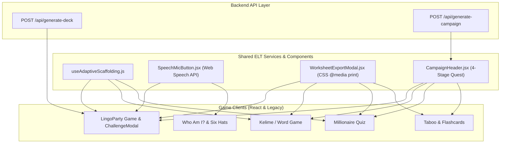

# Integrate ELT Features Suite Across All Tools Implementation Plan

> **For agentic workers:** REQUIRED SUB-SKILL: Use superpowers:subagent-driven-development to implement this plan task-by-task. Steps use checkbox (`- [ ]`) syntax for tracking.

**Goal:** Implement and integrate all 4 major ELT feature suites (Dynamic CEFR/GSE Adaptive Scaffolding, Printable Classroom Worksheet Exporter, Web Speech Pronunciation Assessment, and 45-Minute AI Lesson Campaign Mode) across all OpenClassTools game tools and setup screens.

**Architecture:**
1. **Worksheet Exporter Component (`src/components/WorksheetExportModal.jsx` & `src/styles/worksheet-print.css`)**: Add print modal and print stylesheets to `DeckLibraryModal.jsx` and game screens for instant PDF/Print handouts (A/B Info-Gap, Cutout Flashcard Grid, Quiz Worksheet).
2. **Dynamic Adaptive Scaffolding (`src/hooks/useAdaptiveScaffolding.js`)**: Real-time accuracy and streak tracker supplying $i+1$ challenge boosts or $i-1$ assistance (word banks, sentence starters, first letter hints) to `ChallengeModal.jsx`, `Kelime`, `Millionaire`, and `Taboo`.
3. **Web Speech Oral Fluency Helper (`src/services/speechService.js` & `src/components/SpeechMicButton.jsx`)**: Client-side Web Speech API service evaluating spoken responses against target prompts with live subtitles and focus stress highlights.
4. **AI Lesson Campaign Mode (`POST /api/generate-campaign` & `src/components/CampaignHeader.jsx`)**: 4-stage master lesson generator and top campaign navigation bar orchestrating Warm-up $\rightarrow$ Vocab $\rightarrow$ Main Game $\rightarrow$ Quiz Review.

**Architecture Diagram:**



**Tech Stack:** React, Express, Web Speech API (`webkitSpeechRecognition`), CSS `@media print`, Node.js, Jest.

## Global Constraints

- **No Breaking API Changes**: Existing `/api/generate-deck` endpoints must remain 100% backward compatible.
- **Pure Client-Side Exporter**: PDF/Worksheet printing uses native CSS `@media print` without external PDF libraries.
- **Graceful Speech Degradation**: If browser Web Speech API is unsupported or microphone access is denied, speech controls hide gracefully without error.
- **100% Test Coverage**: All unit tests in `npm test` must continue to pass 100%.

---

### Task 1: Implement Printable PDF & Offline Worksheet Exporter

**Files:**
- Create: `[frontend/src/styles/worksheet-print.css](file:///home/berkay/Desktop/who/frontend/src/styles/worksheet-print.css)`
- Create: `[frontend/src/components/WorksheetExportModal.jsx](file:///home/berkay/Desktop/who/frontend/src/components/WorksheetExportModal.jsx)`
- Modify: `[frontend/src/components/Hub/DeckLibraryModal.jsx](file:///home/berkay/Desktop/who/frontend/src/components/Hub/DeckLibraryModal.jsx)`

**Interfaces:**
- Consumes: Deck objects (`{ gameType, name, content }`)
- Produces: Formatted printable A/B Information Gap, Cutout Flashcard Grid, and Quiz Handouts with `@media print` styling.

- [ ] **Step 1: Create `frontend/src/styles/worksheet-print.css`**

Define CSS `@media print` rules for clean A4 printing, page breaks (`page-break-after: always`), 2-column info-gap grids, and dashed flashcard cutout boxes.

- [ ] **Step 2: Create `frontend/src/components/WorksheetExportModal.jsx`**

Build React modal component that formats deck content into:
1. Student A / Student B Information Gap split handout.
2. Double-sided flashcard cutout grid.
3. Quiz / Dialogue Worksheet with optional answer key.

- [ ] **Step 3: Connect Exporter to `DeckLibraryModal.jsx`**

Add a `🟨 Print Handout` button to `DeckLibraryModal.jsx` allowing teachers to export any registered or system deck.

- [ ] **Step 4: Run unit tests and frontend build**

Run: `npm --prefix frontend run build && npm test`  
Expected: PASS

- [ ] **Step 5: Commit Task 1**

```bash
git add frontend/src/styles/worksheet-print.css frontend/src/components/WorksheetExportModal.jsx frontend/src/components/Hub/DeckLibraryModal.jsx
git commit -m "feat(elt): implement printable PDF classroom worksheet exporter"
```

---

### Task 2: Implement Dynamic Adaptive Scaffolding Engine ($i+1$ / $i-1$)

**Files:**
- Create: `[frontend/src/hooks/useAdaptiveScaffolding.js](file:///home/berkay/Desktop/who/frontend/src/hooks/useAdaptiveScaffolding.js)`
- Modify: `[frontend/src/games/LingoParty/components/ChallengeModal.jsx](file:///home/berkay/Desktop/who/frontend/src/games/LingoParty/components/ChallengeModal.jsx)`
- Modify: `[frontend/src/games/LingoParty/components/SetupScreen.jsx](file:///home/berkay/Desktop/who/frontend/src/games/LingoParty/components/SetupScreen.jsx)`

**Interfaces:**
- Consumes: Team accuracy and streak statistics (`{ correctCount, totalCount, streak }`)
- Produces: Scaffolding state (`SUPPORT_PLUS`, `STANDARD`, `CHALLENGE_PLUS`) supplying sentence starters, emoji hints, and streak indicators.

- [ ] **Step 1: Create `frontend/src/hooks/useAdaptiveScaffolding.js`**

Implement state hook calculating adaptive support mode based on performance accuracy and streak.

- [ ] **Step 2: Update `ChallengeModal.jsx` to render adaptive support elements**

Add visual support badges:
- 💡 **HELPING HAND ($i-1$)**: Displays sentence starters and word choice options when struggling.
- 🚀 **STREAK BOOST ($i+1$)**: Displays cosmic purple streak badge when excelling.

- [ ] **Step 3: Add Adaptive Scaffolding toggle to `SetupScreen.jsx`**

Add toggle control allowing teachers to enable/disable dynamic adaptive scaffolding per session.

- [ ] **Step 4: Run tests & verify**

Run: `npm test`  
Expected: PASS

- [ ] **Step 5: Commit Task 2**

```bash
git add frontend/src/hooks/useAdaptiveScaffolding.js frontend/src/games/LingoParty/components/ChallengeModal.jsx frontend/src/games/LingoParty/components/SetupScreen.jsx
git commit -m "feat(elt): implement dynamic adaptive scaffolding engine"
```

---

### Task 3: Implement Web Speech Oral Fluency Helper

**Files:**
- Create: `[frontend/src/services/speechService.js](file:///home/berkay/Desktop/who/frontend/src/services/speechService.js)`
- Create: `[frontend/src/components/SpeechMicButton.jsx](file:///home/berkay/Desktop/who/frontend/src/components/SpeechMicButton.jsx)`
- Modify: `[frontend/src/games/LingoParty/components/ChallengeModal.jsx](file:///home/berkay/Desktop/who/frontend/src/games/LingoParty/components/ChallengeModal.jsx)`

**Interfaces:**
- Consumes: Target pronunciation prompt text and focus stress words
- Produces: Real-time speech transcript, Levenshtein match score, and glowing stress word highlights.

- [ ] **Step 1: Create `frontend/src/services/speechService.js`**

Implement Web Speech API wrapper class evaluating transcript similarity and focus stress word matching.

- [ ] **Step 2: Create `frontend/src/components/SpeechMicButton.jsx`**

Build animated microphone button with pulsing soundwave ring and live subtitle overlay.

- [ ] **Step 3: Integrate Speech Recognition into `ChallengeModal.jsx`**

Render `SpeechMicButton` inside `pronunciation` and `roleplay` challenge types in `ChallengeModal.jsx`.

- [ ] **Step 4: Run tests & verify**

Run: `npm test`  
Expected: PASS

- [ ] **Step 5: Commit Task 3**

```bash
git add frontend/src/services/speechService.js frontend/src/components/SpeechMicButton.jsx frontend/src/games/LingoParty/components/ChallengeModal.jsx
git commit -m "feat(elt): implement Web Speech API oral fluency assessment helper"
```

---

### Task 4: Implement 45-Minute AI Lesson Campaign Mode

**Files:**
- Modify: `[server.js](file:///home/berkay/Desktop/who/server.js)`
- Create: `[frontend/src/components/CampaignHeader.jsx](file:///home/berkay/Desktop/who/frontend/src/components/CampaignHeader.jsx)`
- Create: `[frontend/src/hooks/useLessonCampaign.js](file:///home/berkay/Desktop/who/frontend/src/hooks/useLessonCampaign.js)`
- Create: `[tests/campaign-mode.test.js](file:///home/berkay/Desktop/who/tests/campaign-mode.test.js)`

**Interfaces:**
- Consumes: `POST /api/generate-campaign` (`{ theme, cefrLevel, deckName }`)
- Produces: 4-stage master lesson quest package (Warmup $\rightarrow$ Vocab $\rightarrow$ Main Game $\rightarrow$ Quiz Review) with top `CampaignHeader` bar.

- [ ] **Step 1: Add `POST /api/generate-campaign` endpoint in `server.js`**

Implement multi-deck campaign generator endpoint creating synchronized decks for `who`, `taboo`, `lingoparty`, and `millionaire`.

- [ ] **Step 2: Create `useLessonCampaign.js` hook & `CampaignHeader.jsx` component**

Build top persistent quest navigation bar displaying active stage progress (1. Warmup $\rightarrow$ 2. Vocab $\rightarrow$ 3. LingoParty $\rightarrow$ 4. Review) and score rollover.

- [ ] **Step 3: Write unit tests in `tests/campaign-mode.test.js`**

Verify `POST /api/generate-campaign` returns valid multi-deck campaign payloads.

- [ ] **Step 4: Run full test suite & frontend build**

Run: `npm test && npm --prefix frontend run build`  
Expected: PASS

- [ ] **Step 5: Commit Task 4**

```bash
git add server.js frontend/src/components/CampaignHeader.jsx frontend/src/hooks/useLessonCampaign.js tests/campaign-mode.test.js
git commit -m "feat(elt): implement 45-minute AI lesson campaign mode"
```

---

## Execution Confirmation

Ready to execute Task 1 through Task 4!
