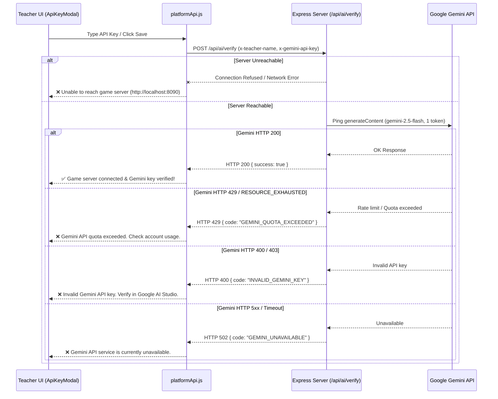

# Design Spec: Auto-Triggered API Server Check & Gemini Key Verification

## Overview
When teachers configure their Teacher Name and Gemini API key in `ApiKeyModal`, the application must automatically verify that:
1. The Express game server is reachable.
2. The provided Gemini API key can successfully authenticate against the Google Gemini API.
3. If an error occurs (such as quota exceeded, invalid API key, service down, or server unreachable), clear diagnostic feedback is displayed immediately in the modal.

## Architecture & Data Flow

## Detailed Specifications

### 1. Backend Endpoint (`POST /api/ai/verify`)
- **Location**: `server.js` (using `createGenerationHandler` or direct route)
- **Headers**:
  - `x-teacher-name`: Required teacher display name (max 120 chars)
  - `x-gemini-api-key`: Required Gemini API key
- **Response Format**:
  - `200 OK`: `{ "success": true, "status": "ok", "message": "Gemini API key verified successfully" }`
  - `400 Bad Request`: `{ "success": false, "code": "INVALID_GEMINI_KEY", "error": "Invalid Gemini API key. Please check your key in Google AI Studio." }`
  - `429 Too Many Requests`: `{ "success": false, "code": "GEMINI_QUOTA_EXCEEDED", "error": "Gemini API quota or rate limit exceeded. Please check your Gemini API account limit." }`
  - `502 Bad Gateway`: `{ "success": false, "code": "GEMINI_UNAVAILABLE", "error": "Gemini API service is currently unavailable. Please try again later." }`

### 2. Frontend Verification Client (`platformApi.js` & `platform-client.js`)
- Add `verifyTeacherKey({ teacherDisplayName, geminiApiKey })`:
  - Sends `POST /api/ai/verify` with a 10-second timeout.
  - Catches network errors and throws `PlatformApiError('Unable to reach the game server')`.
  - Parses structured error codes (`GEMINI_QUOTA_EXCEEDED`, `INVALID_GEMINI_KEY`, etc.).

### 3. Teacher Settings UI (`ApiKeyModal.jsx`)
- **Debounced Auto-Verification**: 600ms debounce after user finishes editing input (when key length >= 10 chars).
- **Status Indicator**:
  - Loading: `📡 Verifying game server & Gemini key...`
  - Success: `✅ Game server connected & Gemini API key verified!`
  - Error: Red badge displaying exact error message.
- **Save Guard**: Submit button validates connection before completing save.

## Testing & Verification Plan
- **Backend Unit Tests** (`tests/server.test.js`): Test `/api/ai/verify` with valid key, missing headers, invalid key, and rate limit simulation.
- **Frontend Unit Tests** (`tests/platform-client.test.js`): Test `verifyTeacherKey` error handling for server down, quota exceeded, and success responses.
- **Integration**: Verify `npm test` and build check.
