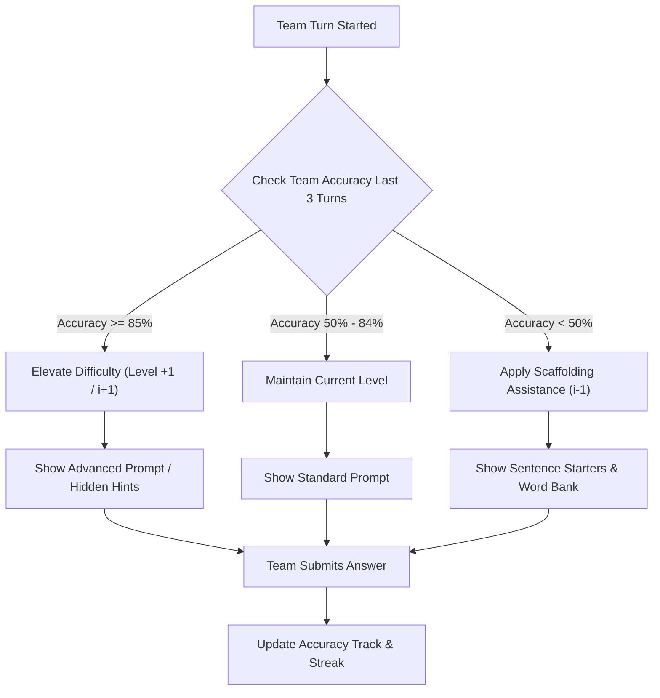

# Feature Specification: Dynamic CEFR / GSE Adaptive In-Game Scaffolding

**Date**: 2026-08-06  
**Author**: AI Pair Programmer  
**Status**: Research & Proposal  

---

## 1. Executive Summary & ELT Pedagogy

In English Language Teaching (ELT), learners perform best when challenged within Vygotsky's **Zone of Proximal Development (ZPD)** and Stephen Krashen's **$i+1$ Comprehensible Input Hypothesis**. If questions are consistently too easy, learners become bored; if questions are too complex without support, cognitive overload causes frustration and silence.

This feature adds **Dynamic Adaptive Scaffolding** to OpenClassTools games (`LingoParty`, `Kelime`, `Millionaire`). As teams play, the game engine continuously monitors team accuracy and response times, automatically adjusting hint levels, sentence frames, and challenge difficulty in real-time.

---

## 2. Pearson GSE & CEFR Mapping Matrix

The engine uses Pearson's **Global Scale of English (GSE)** ranges alongside the Common European Framework of Reference (CEFR):

| CEFR Level | GSE Range | Scaffolding Level | Assistance Provided when Struggling ($i-1$) | Acceleration when Excelling ($i+1$) |
| :--- | :--- | :--- | :--- | :--- |
| **A1 - A2** | 10 - 38 | High Support | Word bank choices, visual emoji hints, target first letter shown. | Require complete unassisted spelling or sentence production. |
| **B1 - B2** | 39 - 68 | Medium Support | Functional sentence starters (e.g. *"In my opinion..."*), collocation lists. | Reduce timer to 10s, remove hint choices, add distractors. |
| **C1 - C2** | 69 - 90+ | Autonomous | Nuanced register cues, idiomatic phrasing options. | Complex speed-relays and idiomatic negotiation challenges. |

---

## 3. Real-Time Scaffolding State Machine



---

## 4. Technical Implementation & Data Schema

### 4.1 Client-Side State Additions (`LingoPartyGame.jsx` / `game.js`)

```javascript
// Dynamic Team Performance State
const [teamMetrics, setTeamMetrics] = useState({
  team1: { totalCount: 0, correctCount: 0, streak: 0, currentLevel: 'B1' },
  team2: { totalCount: 0, correctCount: 0, streak: 0, currentLevel: 'B1' }
});

export function calculateScaffoldingState(metrics) {
  const accuracy = metrics.totalCount > 0 ? metrics.correctCount / metrics.totalCount : 0.7;
  if (accuracy >= 0.85 && metrics.streak >= 2) {
    return { mode: 'CHALLENGE_PLUS', showWordBank: false, timerMultiplier: 0.8 };
  }
  if (accuracy < 0.5) {
    return { mode: 'SUPPORT_PLUS', showWordBank: true, showFirstLetter: true, timerMultiplier: 1.3 };
  }
  return { mode: 'STANDARD', showWordBank: false, timerMultiplier: 1.0 };
}
```

### 4.2 Prompt Engine Additions (`prompts.json`)

Adding adaptive hint fields to generated JSON decks:
```json
{
  "type": "scramble",
  "scrambledWord": "C-O-L-L-O-C-A-T-I-O-N",
  "targetWord": "COLLOCATION",
  "clue": "Words that frequently co-occur together naturally in language.",
  "scaffolding": {
    "firstLetter": "C",
    "wordBank": ["COLLOCATION", "CONJUGATION", "COLLABORATION"],
    "sentenceStarter": "In English, a natural word pairing is called a..."
  }
}
```

---

## 5. UI Integration

* **Challenge Modal Badges**:
  * 🚀 **STREAK BOOST ($i+1$)**: Displayed in vibrant cosmic purple when a team is excelling.
  * 💡 **HELPING HAND ($i-1$)**: Displayed in warm amber when scaffolding assistance (word bank/sentence starter) is activated.
* **Teacher Controls**:
  * Toggle switch on `SetupScreen.jsx`: `⚡ Adaptive Scaffolding (Auto-adjust difficulty)`.

---

## 6. Verification & Test Plan

1. Unit test `calculateScaffoldingState()` with mock accuracy percentages (0%, 40%, 70%, 90%).
2. Verify hint visibility toggles correctly in `ChallengeModal.jsx`.
3. Test end-to-end deck generation to verify `scaffolding` helper metadata parsing.
