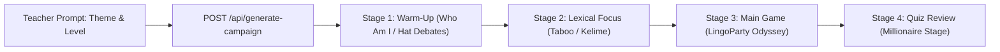

# Feature Specification: AI 45-Minute Lesson Campaign Mode (Classroom Quest)

**Date**: 2026-08-06  
**Author**: AI Pair Programmer  
**Status**: Research & Proposal  

---

## 1. Executive Summary & ELT Pedagogy

A standard 45-to-60 minute EFL/ELT lesson follows Jane Willis's **Task-Based Language Teaching (TBLT)** framework:
1. **Pre-Task (Warm-Up & Lexical Activation)**: Engaging schema building and introducing core concepts.
2. **Task Cycle (Practice & Collaboration)**: Active group gameplay with information exchange and problem solving.
3. **Post-Task (Language Focus & Formative Review)**: Consolidating target language and assessing learning outcomes.

Currently, teachers generate individual decks for separate games one-by-one. **AI Lesson Campaign Mode** generates a synchronized **4-Stage Master Lesson Package** from a single prompt (e.g., *"Job Interviews & Professional English for B2 Learners"*).

---

## 2. The 4-Stage Classroom Quest Flow



| Stage | Duration | Primary Game | ELT Functional Purpose | Generated Content |
| :--- | :--- | :--- | :--- | :--- |
| **Stage 1: Warm-Up** | 5-7 mins | `Who Am I?` or `Six Hats` | Activate schema, prime topic curiosity, encourage initial speaking. | 10 iconic figures/roles tied to theme. |
| **Stage 2: Lexical Focus** | 10 mins | `Taboo` / `Kelime` | Build circumlocution, target collocations, clarify core vocabulary. | 10 Taboo cards with zero-leak forbidden words. |
| **Stage 3: Main Task** | 20 mins | `LingoParty` | Experiential collaboration across 8 challenge categories. | 40 LingoParty cards (5 per category). |
| **Stage 4: Review** | 10 mins | `Millionaire` | Formative evaluation, consolidate learning, celebrate achievement. | 15 progressive multiple-choice questions. |

---

## 3. API Contract & Data Schema

### Endpoint: `POST /api/generate-campaign`

#### Request Body:
```json
{
  "theme": "Sustainable Energy & Climate Action",
  "cefrLevel": "B2",
  "deckName": "Climate Action Lesson Plan"
}
```

#### Response Payload:
```json
{
  "campaignId": "camp_9f8a21b",
  "theme": "Sustainable Energy & Climate Action",
  "cefrLevel": "B2",
  "stages": {
    "warmup": {
      "gameType": "who",
      "deckId": "deck_w1",
      "content": ["Greta Thunberg", "Rachel Carson", "Solar Engineer"]
    },
    "lexical": {
      "gameType": "taboo",
      "deckId": "deck_t1",
      "content": [
        { "word": "SOLAR PANEL", "forbidden": ["SUN", "ENERGY", "ROOF", "ELECTRICITY", "LIGHT"] }
      ]
    },
    "main": {
      "gameType": "lingoparty",
      "deckId": "deck_l1",
      "content": [ /* 40 LingoParty cards */ ]
    },
    "review": {
      "gameType": "millionaire",
      "deckId": "deck_m1",
      "content": [ /* 15 Millionaire questions */ ]
    }
  }
}
```

---

## 4. UI Campaign Header Component

A top persistent navigation bar rendered in the Hub and Game screens during Campaign Mode:

```
[ 🚀 LESSON CAMPAIGN: Climate Action (B2) ]  [ 1. Warm-up ✓ ] -> [ 2. Vocab ✓ ] -> [ 3. LingoParty (ACTIVE) ] -> [ 4. Quiz ]  [ Next Stage ➔ ]
```

* **Seamless Transitions**: One click on `Next Stage` saves current team scores and launches the next game pre-loaded with the campaign's corresponding deck.
* **Aggregated Session Score**: Scores earned in Taboo and LingoParty roll over into bonus lifelines or start points in the final Millionaire stage!

---

## 5. Implementation Milestones

1. Backend endpoint `POST /api/generate-campaign` using single AI prompt or orchestrated batch calls.
2. React state hook `useLessonCampaign.js` managing active stage index and score rollover.
3. Top `CampaignHeader.jsx` bar with visual step progress indicators.
4. Unit tests in `tests/campaign-mode.test.js`.
