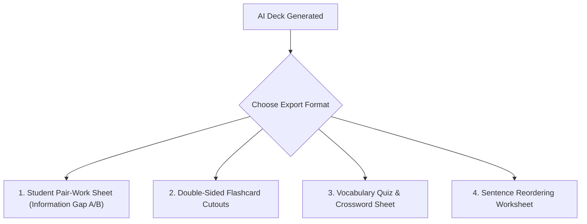

# Feature Specification: Printable PDF & Offline Extension Worksheet Exporter

**Date**: 2026-08-06  
**Author**: AI Pair Programmer  
**Status**: Research & Proposal  

---

## 1. Executive Summary & ELT Pedagogy

In many teaching environments (schools with limited device ratios, low-bandwidth classrooms, or homework assignments), digital games must bridge cleanly to **offline materials**. Material development in ELT (Tomlinson, 2011) emphasizes multi-modal reinforcement—moving between screen interactions and tactile pen-and-paper reflection.

This feature enables teachers to convert **any generated AI game deck** into formatted, print-ready PDF classroom handouts with a single click.

---

## 2. Worksheet Formats & Templates



### 2.1 Format Breakdown

1. **Pair-Work Information Gap Handout (Student A / Student B)**:
   * Formats `Taboo` or `Kelime` cards into two split columns.
   * Student A receives clues for target words 1-5 (describing to Student B), while Student B receives clues for target words 6-10.
   * Promotes communicative oral interaction without looking at each other's papers.

2. **Double-Sided Flashcard Grid**:
   * Formats `Flashcards` into a $3 \times 3$ grid per page.
   * Front page contains target English words and pronunciation cues; reverse page aligns exact Turkish/English definitions for easy printing and cutting.

3. **Dialogue & Grammar Challenge Worksheet**:
   * Formats `LingoParty` `ordering` and `grammar` challenges into a clean, numbered student worksheet with answer key on the last page.

---

## 3. Technical Architecture (Zero External Dependencies)

To avoid heavy server-side PDF render engines (like Puppeteer), the exporter uses pure **CSS `@media print`** stylesheets rendered via a lightweight React modal window `WorksheetExportModal.jsx` or standard browser `window.print()`.

### CSS Print Token Design (`worksheet-print.css`):

```css
@media print {
  body {
    background: #ffffff !important;
    color: #111827 !important;
    font-family: 'Inter', system-ui, sans-serif;
  }

  .no-print, nav, header, button {
    display: none !important;
  }

  .print-page {
    page-break-after: always;
    padding: 20mm;
  }

  .info-gap-grid {
    display: grid;
    grid-template-columns: 1fr 1fr;
    gap: 24px;
    border-top: 2px solid #e5e7eb;
  }

  .flashcard-cutout-grid {
    display: grid;
    grid-template-columns: repeat(3, 1fr);
    gap: 12px;
  }

  .flashcard-box {
    border: 2px dashed #9ca3af;
    padding: 16px;
    text-align: center;
    border-radius: 8px;
  }
}
```

---

## 4. UI Trigger Integration

* **Deck Library Modal (`DeckLibraryModal.jsx`)**: Add a `🟨 Print Handout` button next to `Play Game`.
* **Setup Screens**: Add an `Export PDF Worksheet` option right after AI generation completes.
* **Modal Preview**: Opens a modal showing a live preview of the formatted worksheet with toggles for:
  - Header Title & School Name input
  - Include Answer Key [YES/NO]
  - Target Student Level Badge (e.g. `CEFR B1`)

---

## 5. Verification Plan

1. Test `@media print` formatting across Chrome, Firefox, and Edge.
2. Verify page break logic (`page-break-after: always`) prevents awkwardly split cards across pages.
3. Test double-sided flashcard alignment for physical printing accuracy.
