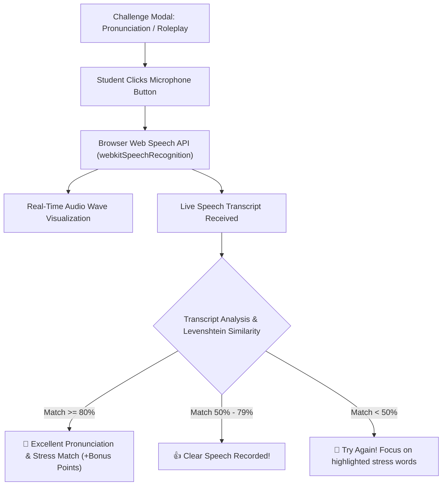

# Feature Specification: Spoken Fluency & AI Speech-to-Text Pronunciation Assessment

**Date**: 2026-08-06  
**Author**: AI Pair Programmer  
**Status**: Research & Proposal  

---

## 1. Executive Summary & ELT Pedagogy

A central objective in modern English Language Teaching (ELT) is encouraging **Willingness to Communicate (WTC)** and building **oral fluency**. However, in large classrooms, quiet or anxious students rarely get sufficient individual speaking time, and teachers cannot listen to 30 students speaking at once.

This feature integrates the browser's native **Web Speech API (`SpeechRecognition` / `webkitSpeechRecognition`)** into `LingoParty` (Pronunciation, Roleplay) and `Who Am I?`. Students can speak directly into their microphone during speaking challenges, receiving instant visual transcript feedback, pronunciation accuracy scores, and focus stress validation.

---

## 2. Audio Processing Flow



---

## 3. Client-Side Implementation Details

### 3.1 Web Speech API Service (`src/services/speechService.js`)

```javascript
export class SpeechAssessmentService {
  constructor() {
    const SpeechRecognition = window.SpeechRecognition || window.webkitSpeechRecognition;
    this.recognition = SpeechRecognition ? new SpeechRecognition() : null;
    if (this.recognition) {
      this.recognition.continuous = false;
      this.recognition.interimResults = true;
      this.recognition.lang = 'en-US';
    }
  }

  isSupported() {
    return !!this.recognition;
  }

  startListening(onResult, onError) {
    if (!this.recognition) return;
    this.recognition.onresult = (event) => {
      const transcript = Array.from(event.results)
        .map(result => result[0].transcript)
        .join('');
      const isFinal = event.results[0].isFinal;
      onResult({ transcript, isFinal });
    };
    this.recognition.onerror = onError;
    this.recognition.start();
  }

  stopListening() {
    if (this.recognition) this.recognition.stop();
  }
}
```

### 3.2 Phonetic Match & Similarity Algorithm

Using normalized Levenshtein Distance & target key-word matching:

```javascript
export function evaluatePronunciation(spokenTranscript, targetSentence, focusWords = []) {
  const cleanSpoken = spokenTranscript.toLowerCase().replace(/[^\w\s]/g, '');
  const cleanTarget = targetSentence.toLowerCase().replace(/[^\w\s]/g, '');

  const wordsSpoken = new Set(cleanSpoken.split(/\s+/));
  const focusMatches = focusWords.filter(w => wordsSpoken.has(w.toLowerCase()));

  const similarityScore = calculateLevenshteinSimilarity(cleanSpoken, cleanTarget);
  const focusScore = focusWords.length > 0 ? focusMatches.length / focusWords.length : 1.0;

  const totalScore = Math.round((similarityScore * 0.6 + focusScore * 0.4) * 100);

  return {
    totalScore,
    isPass: totalScore >= 65,
    matchedFocusWords: focusMatches
  };
}
```

---

## 4. UI & Visual Feedback

* **Live Microphone Control in `ChallengeModal.jsx`**:
  * 🎙️ **"Hold & Speak" Button**: Animated pulsing mic ring that changes from cyan to glowing magenta when receiving audio.
  * **Real-time Subtitles**: Shows live spoken text under the prompt card as the student speaks.
  * **Highlight Words**: Target focus stress words glow green when correctly pronounced.
* **Privacy & Compatibility**:
  * 100% client-side execution; zero audio recorded or sent to remote servers.
  * Automatic graceful fallback to manual teacher verification when microphone access is denied or browser unsupported.

---

## 5. Verification Plan

1. Mock `webkitSpeechRecognition` event loop in Jest tests (`tests/speech-assessment.test.js`).
2. Test Levenshtein distance calculations against target pronunciation sentences.
3. Test UI microphone state transitions (idle, listening, processing, success, retry).
