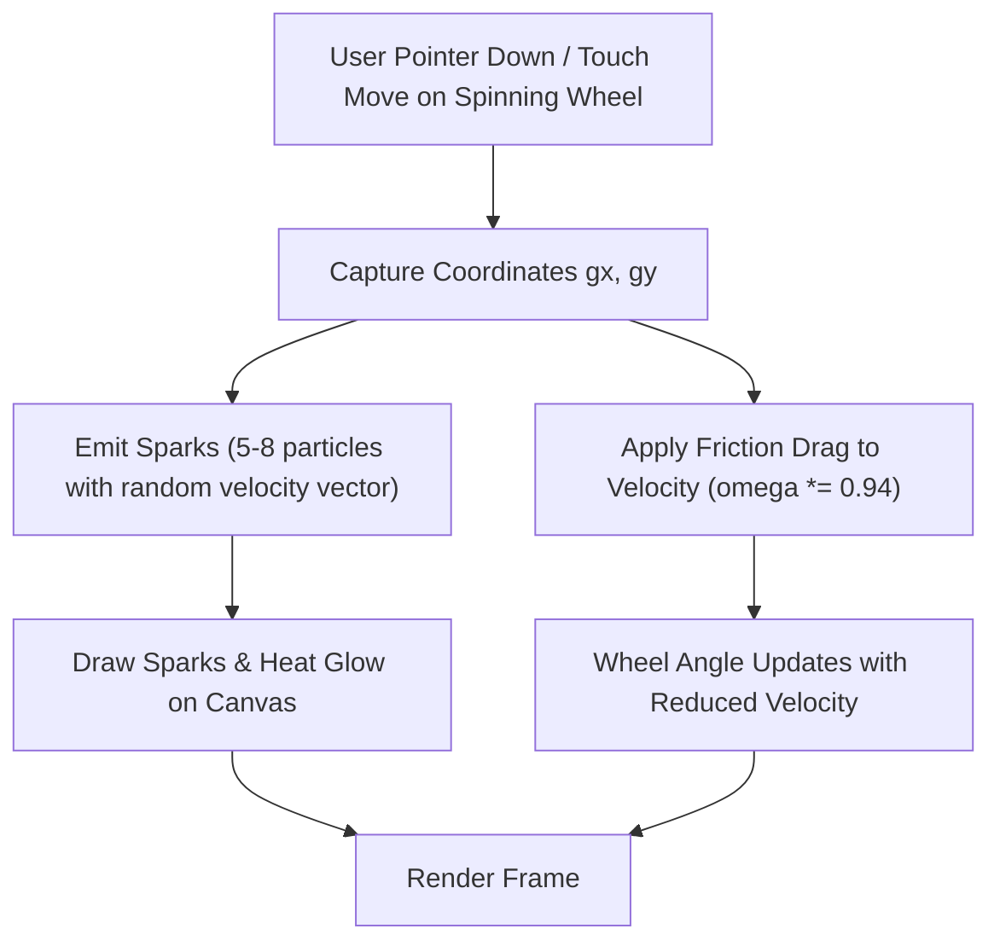

# Feature Specification: Wheel Interactive Friction & Grinding Effect ("Illusion of Control")

**Date**: 2026-08-06  
**Author**: AI Pair Programmer  
**Status**: Proposal & Execution Spec  

---

## 1. Overview & Physics UX Concept

When a digital wheel spins autonomously, users often feel like passive observers. By adding **Interactive Friction & Spark Grinding**, touching or holding down on the wheel/modal during a spin creates an authentic **illusion of physical control**:

1. **Touch / Click Particle Burst (Grinding Sparks)**: Touch/mouse contact at coordinates $(x, y)$ emits bright friction spark particles, smoke trails, and a glowing heat ring.
2. **Physical Slowdown (Angular Drag)**: Holding down applies continuous friction deceleration ($\omega_{new} = \omega \times \text{frictionDamping}$ e.g., $\times 0.94$ per frame), physically slowing down the wheel in proportion to the hold duration.
3. **Audio-Tactile Feedback**: Generates rapid micro-vibration ticks and high-velocity friction feedback.

---

## 2. Physics & Particle Engine Architecture



### 2.1 Particle System Interface

```javascript
interface SparkParticle {
  x: number;
  y: number;
  vx: number;
  vy: number;
  life: number;      // 1.0 down to 0
  maxLife: number;   // e.g. 15-25 frames
  size: number;
  color: string;     // '#f59e0b', '#ef4444', '#fef08a'
}
```

### 2.2 Angular Velocity & Friction Physics Formula

During normal spin, angular position follows standard ease-out:
$$\theta(t) = \theta_{start} + \Delta\theta \cdot (1 - (1 - t)^5)$$

When user holds/grinds at frame $k$:
- Active velocity $v_k = \theta_{k} - \theta_{k-1}$
- Friction applied: $v_{k, friction} = v_k \cdot 0.94$
- Updated position: $\theta_{k+1} = \theta_k + v_{k, friction}$

---

## 3. Targeted Components

1. **`CosmicWheelModal.jsx`** (React LingoParty Cosmic Wheel):
   - Pointer events (`onPointerDown`, `onPointerMove`, `onPointerUp`, `onPointerLeave`) on canvas and modal backdrop.
   - Canvas spark renderer overlay.
2. **`wheel.js`** (Standalone Wheel of Names HTML5 Canvas):
   - Touch and mouse listeners (`touchstart`, `touchmove`, `touchend`, `mousedown`, `mousemove`, `mouseup`).
   - Friction angular velocity decay.

---

## 4. Verification & Testing Plan

1. Test touch/mouse event tracking during spin state.
2. Test spark particle lifecycle (spawning, rendering, fading).
3. Test physics slowdown behavior (ensuring wheel still resolves smoothly to a valid segment winner without getting stuck mid-segment).
4. Run `npm --prefix frontend run build` and `npm test`.
